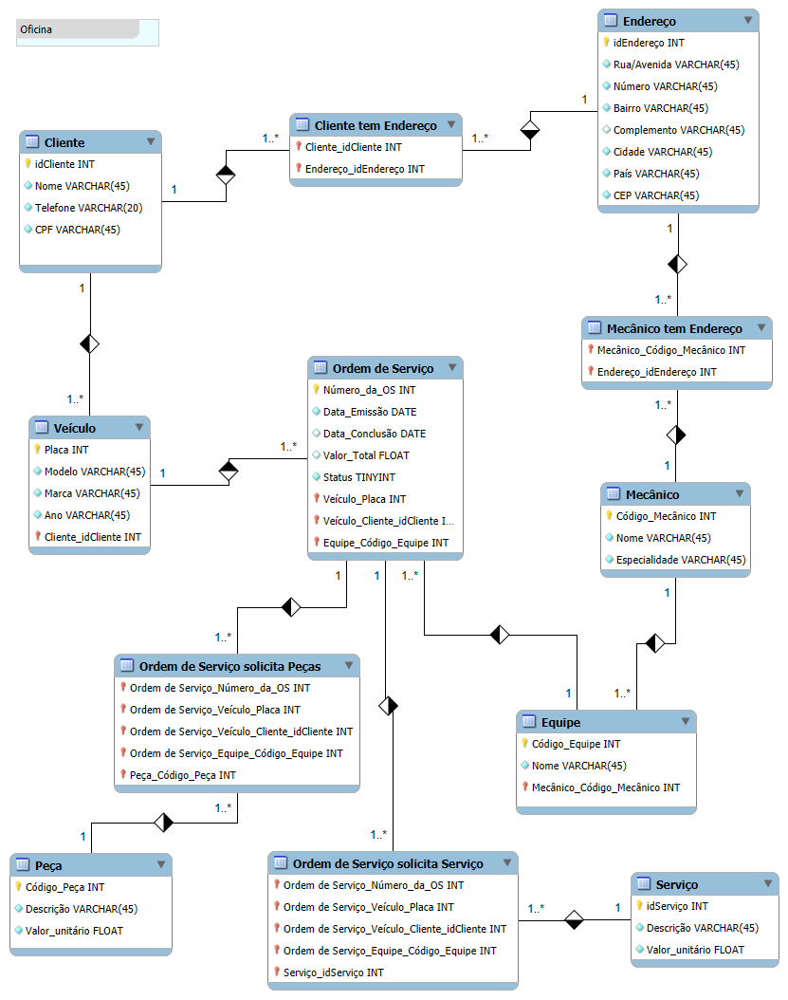

# ⚙️ Design do Banco de Dados de Oficina Mecânica: Mantendo seu Negócio em Movimento

Este repositório apresenta o **Diagrama de Entidade-Relacionamento (DER)** que sustenta a base de dados de uma oficina mecânica, garantindo organização e eficiência na gestão de informações. Projetado com o auxílio de uma ferramenta de modelagem de banco de dados, o modelo é robusto e escalável, ideal para o dia a dia de uma oficina. 🚀

 

## 🌟 **Sobre o Projeto**

Este trabalho foi desenvolvido como parte do curso **"Construindo um Esquema Conceitual para Banco De dados"**, ministrado por [Juliana Mascarenhas](https://www.linkedin.com/in/juliana-mascarenhas-ds/), no **Bootcamp da [Suzano](https://www.linkedin.com/company/suzano/posts/?feedView=all) - Análise de Dados com Power BI**, em parceria com a [DIO](https://www.dio.me/). 

O **DER** foi elaborado para modelar um sistema de gerenciamento de oficina mecânica, abrangendo clientes, veículos, ordens de serviço, peças, mecânicos e equipes. O objetivo é criar um modelo de dados eficiente e escalável para o registro e acompanhamento de todas as atividades da oficina.

 

## 📈 **Visualização do Diagrama**

   

 

## 🧱 **Entidades e Atributos**

### 1. **Cliente:**
🧍 Informações essenciais sobre os clientes da oficina.
- **Atributos:**
   - `idCliente` (INT, PK) – Identificador único do cliente.
   - `Nome` (VARCHAR(45)) – Nome completo do cliente.
   - `Telefone` (VARCHAR(20)) – Número de telefone do cliente.
   - `CPF` (VARCHAR(45)) – Número do CPF do cliente.

### 2. **Veículo:**
🚗 Dados referentes aos veículos dos clientes.
- **Atributos:**
   - `idVeiculo` (INT, PK) – Identificador único do veículo.
   - `Placa` (VARCHAR(45)) – Placa do veículo.
   - `Modelo` (VARCHAR(45)) – Modelo do veículo.
   - `Marca` (VARCHAR(45)) – Marca do veículo.
   - `Ano` (YEAR) – Ano do veículo.
   - `idCliente` (INT, FK) – Referência à tabela Cliente (chave estrangeira).

### 3. **Endereço:**
🏠 Localização dos clientes e mecânicos.
- **Atributos:**
   - `idEndereco` (INT, PK) – Identificador único do endereço.
   - `Rua` (VARCHAR(45)) – Nome da rua.
   - `Numero` (VARCHAR(10)) – Número do endereço.
   - `Complemento` (VARCHAR(45)) – Complemento do endereço (apto., bloco, etc.).
   - `Bairro` (VARCHAR(45)) – Nome do bairro.
   - `Cidade` (VARCHAR(45)) – Nome da cidade.
   - `Estado` (VARCHAR(2)) – Sigla do estado.
   - `CEP` (VARCHAR(9)) – CEP do endereço.

### 4. **Mecânico:**
👨‍🔧 Dados sobre os mecânicos da oficina.
- **Atributos:**
   - `idMecanico` (INT, PK) – Identificador único do mecânico.
   - `Nome` (VARCHAR(45)) – Nome completo do mecânico.
   - `Especialidade` (VARCHAR(45)) – Especialidade do mecânico.

### 5. **Equipe:**
🤝 Grupos de mecânicos que trabalham em conjunto.
- **Atributos:**
   - `idEquipe` (INT, PK) – Identificador único da equipe.
   - `Nome` (VARCHAR(45)) – Nome da equipe.

### 6. **Ordem de Serviço:**
📝 Registro das ordens de serviço emitidas.
- **Atributos:**
   - `idOrdemServico` (INT, PK) – Identificador único da ordem de serviço.
   - `NumeroOS` (INT) – Número da ordem de serviço.
   - `DataEmissao` (DATE) – Data de emissão da ordem de serviço.
   - `DataConclusao` (DATE) – Data de conclusão da ordem de serviço.
   - `ValorTotal` (DECIMAL(10,2)) – Valor total da ordem de serviço.
   - `Status` (ENUM('Aberto', 'Em Andamento', 'Concluído')) – Status da ordem de serviço.
   - `idVeiculo` (INT, FK) – Referência à tabela Veículo (chave estrangeira).
   - `idEquipe` (INT, FK) – Referência à tabela Equipe (chave estrangeira).

### 7. **Peça:**
⚙️ Informações sobre as peças utilizadas nos reparos.
- **Atributos:**
   - `idPeca` (INT, PK) – Identificador único da peça.
   - `Descricao` (VARCHAR(45)) – Descrição da peça.
   - `ValorUnitario` (DECIMAL(10,2)) – Valor unitário da peça.

### 8. **Ordem de Serviço tem Peça:** (Tabela de junção)
🔗 Relação N:M entre ordens de serviço e peças utilizadas.
- **Atributos:**
   - `idOrdemServico` (INT, FK) – Referência à tabela Ordem de Serviço (chave estrangeira).
   - `idPeca` (INT, FK) – Referência à tabela Peça (chave estrangeira).

### 9. **Mecanico em Equipe:** (Tabela de junção)
🔗 Relação N:M entre mecânicos e equipes.
- **Atributos:**
   - `idMecanico` (INT, FK) – Referência à tabela Mecânico (chave estrangeira).
   - `idEquipe` (INT, FK) – Referência à tabela Equipe (chave estrangeira).

### 10. **Cliente tem Endereço:** (Tabela de junção)
📍 Ligação entre clientes e seus endereços.
- **Atributos:**
   - `idCliente` (INT, FK) – Referência à tabela Cliente (chave estrangeira).
   - `idEndereco` (INT, FK) – Referência à tabela Endereço (chave estrangeira).

 

## 🔗 **Relacionamentos**

Principais Conexões Entre Entidades:

* **Cliente 1:N Veículo:** Um cliente pode ter vários veículos.
* **Cliente N:M Endereço:** Um cliente pode ter vários endereços, e um endereço pode pertencer a vários clientes.
* **Mecânico N:M Equipe:** Um mecânico pode pertencer a várias equipes, e uma equipe pode ter vários mecânicos.
* **Veículo 1:N Ordem de Serviço:** Um veículo pode estar associado a várias ordens de serviço.
* **Ordem de Serviço N:M Peça:** Uma ordem de serviço pode utilizar várias peças, e uma peça pode ser usada em várias ordens de serviço.
* **Equipe 1:N Ordem de Serviço:** Uma equipe pode realizar várias ordens de serviço.

 

## 🚀 **Por que Isso Importa?**

O modelo garante:

* 📊 **Integridade dos Dados:** Mantendo informações consistentes e precisas.
* 📈 **Escalabilidade:** Preparado para o crescimento da oficina.
* 🔧 **Manutenibilidade:** Estrutura flexível para ajustes e melhorias.
* ⚡ **Eficiência:** Operações otimizadas para alta performance.

 

## 💻 **Tecnologia Utilizada**

- **MySQL Workbench:** Ferramenta usada para modelagem e visualização do banco de dados.

 

## 🛠️ **Como Usar**

Utilize o DER como referência para criar scripts SQL para a criação das tabelas e seus relacionamentos. Implemente o banco de dados para suportar as aplicações da oficina. Expanda ou ajuste conforme as necessidades do negócio.

 

## 👨‍💻 Expert

    
    
&nbsp&nbsp&nbspMarcos Winther 
    &nbsp&nbsp&nbsp
    <a href="https://github.com/MarcosWinther">
    GitHub</a>&nbsp;|&nbsp;
    <a href="https://www.linkedin.com/in/marcoswinthersilva/">LinkedIn</a>
    

  

---

⌨️ com 💜 por [Marcos Winther](https://github.com/MarcosWinther)
